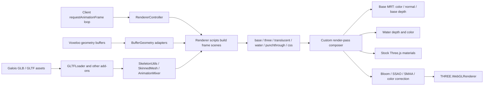

# Three.js Usage and Upgrade Safety Map

Last updated: 2026-08-01

This document maps the Three.js compatibility surface in this repository and
defines the tests and browser checks required before changing the installed
Three.js version.

This started as the upgrade-preparation contract and now records the completed
r185 migration and its repeatable verification gates. It does not authorize a
deployment, restart, or production change.

## Current baseline

```text
three:        0.185.1 / r185
@types/three: 0.185.3
renderer:     WebGLRenderer with a custom multipass composer
```

The runtime and declaration package now target the same r185 API generation.
Future upgrades must continue updating and validating both together.

The 2026-08-01 inventory found 211 TypeScript/JavaScript files with a direct
`three` or `three/examples` import:

| Area | Direct-import files | Main responsibility |
|---|---:|---|
| Client renderers | 56 | Scene construction, entities, terrain, effects, and render passes |
| Client resources | 35 | Meshes, materials, textures, GLTFs, players, NPCs, terrain, flora, glass, water |
| Client Three utilities | 13 | Geometry conversion, animation, GLTF, skinning, particles, textures |
| Client React/UI components | 21 | Character, inventory, admin, art, map, and object previews |
| Renderer wrapper | 1 | WebGL context, color space, pixel ratio, and frame submission |
| Generated shader wrappers | 55 | Raw shader material constructors and update functions |
| Galois UI/runtime | 6 | Asset visualization, GLTF loading, geometry, materials, and animation |
| Shared code | 4 | Spatial/math and shared geometry contracts |
| Other client gameplay/helpers | 13 | Camera, ray, screenshot, navigation, interaction, and cutscene helpers |
| Scripts | 5 | Asset loading and browser visual audits |
| Pages | 2 | GLTF display routes |

Re-run the inventory with:

```bash
rg -l \
  'from ["\x27]three(?:/|["\x27])|import\(["\x27]three(?:/|["\x27])|require\(["\x27]three(?:/|["\x27])' \
  src scripts \
  -g '*.ts' -g '*.tsx' -g '*.js' -g '*.cjs' \
  | sort
```

## Runtime map



## Compatibility boundaries

### 1. WebGL renderer and frame submission — critical

Primary files:

```text
src/client/renderer/pass_renderer.ts
src/client/game/renderers/renderer_controller.ts
src/client/game/context_managers/loop.ts
```

Contracts:

- `WebGLRenderer` construction and `powerPreference: "high-performance"`;
- sRGB output through `outputColorSpace`;
- canvas resize and pixel-ratio behavior;
- renderer timing and `renderer.info` collection;
- one render submission through the custom composer per game frame.

Unit tests can cover configuration helpers, but an actual WebGL context and
shader compilation require browser coverage.

### 2. Scene routing and material identity — critical

Primary files:

```text
src/client/game/renderers/scenes.ts
src/client/game/renderers/base_pass_material.ts
src/client/game/renderers/punchthrough_material.ts
src/client/game/renderers/placeables.ts
src/client/game/renderers/players.ts
src/client/game/renderers/npcs.ts
```

Contracts:

- `instanceof BasePassMaterial`, `PunchthroughMaterial`, `RawShaderMaterial`,
  `Mesh`, `SkinnedMesh`, and `CSS3DObject` must remain reliable;
- transparent materials route to the translucency pass;
- stock Three.js materials route to the secondary pass;
- multi-material meshes inspect every material;
- ordinary mixed roots fail safe to the stock Three.js pass;
- explicitly converted player roots retain their emergency base-pass fallback;
- named raw-shader uniforms are collected as render-pass dependencies.

Coverage:

```text
src/client/game/renderers/test/three_scene_contract.test.ts
src/client/game/renderers/player_lighting.test.ts
```

### 3. Multiple render targets and postprocessing — critical

Primary files:

```text
src/client/game/renderers/passes/scene_base_pass.ts
src/client/game/renderers/passes/composer.ts
src/client/game/renderers/passes/scene_pass.ts
src/client/game/renderers/passes/scene_water_pass.ts
src/client/game/renderers/passes/depth_pre_pass.ts
src/client/game/renderers/passes/shader_pass.ts
src/client/game/renderers/passes/bloom.ts
src/client/game/renderers/passes/ssao.ts
src/client/game/renderers/passes/three_pass.ts
src/client/game/renderers/three_ext/shared_webgl_render_target.ts
src/client/game/renderers/three_ext/depth_peeled_mesh.ts
```

Contracts:

- the base pass owns three color attachments named `Color`, `Normal`, and
  `BaseDepth`, plus the shared depth texture;
- attachment formats remain half-float RGBA, half-float RGBA, and half-float
  red respectively;
- shared targets retain their externally owned color texture;
- resize and disposal preserve ownership rules;
- `FullScreenQuad`, `SMAAPass`, shader materials, and render targets remain
  available and behaviorally compatible.

Completed r185 migration:

```text
SceneBasePass uses WebGLRenderTarget({ count: 3, depthTexture }).
```

The removed `WebGLMultipleRenderTargets` class was replaced with the current
multi-attachment render-target API while preserving the tested color, normal,
base-depth, and shared-depth contract.

Coverage:

```text
src/client/game/renderers/test/three_render_target_contract.test.ts
src/client/game/util/test/three_asset_contract.test.ts
```

### 4. Generated shaders and texture formats — critical

Primary files:

```text
src/gen/client/game/shaders/**
src/client/game/util/textures.ts
src/client/game/resources/materials.ts
src/client/game/resources/blocks.ts
src/client/game/resources/florae.ts
src/client/game/resources/glass.ts
src/client/game/resources/water.ts
src/client/game/resources/terrain.ts
```

Contracts:

- generated `RawShaderMaterial` wrappers remain subclasses recognized by scene
  routing;
- authored GLSL retains `#version 300 es` for standalone validation, while the
  generated embedded shader strings omit that directive and every generated
  material sets `glslVersion: THREE.GLSL3`; this lets Three.js emit the version
  before its `SHADER_TYPE` / `SHADER_NAME` prefix;
- integer terrain textures remain `RedIntegerFormat` / `R32UI` /
  `UnsignedIntType` so GLSL `usampler2D` bindings stay valid;
- color maps retain `SRGB8_ALPHA8` where required;
- texture arrays retain layer dimensions and format;
- uniforms expected by the composer remain present and updateable;
- shader output locations agree with every active MRT attachment.

Generated files are outputs. Fix generator sources rather than hand-editing the
55 generated Three.js shader wrappers.

Coverage:

```text
src/bazel_utils/shaders:shader_gen_ts_test
src/client/game/renderers/test/three_render_target_contract.test.ts
src/client/game/util/test/three_asset_contract.test.ts
src/client/game/renderers/player_lighting.test.ts
scripts/harthmere/test-harthmere-gldrawelements-sampler-fix.cjs
```

Shader compile/link and framebuffer completeness still require WebGL browser
tests.

### 5. Voxeloo-to-Three geometry adapters — high

Primary files:

```text
src/client/game/util/meshes.ts
src/client/game/resources/blocks.ts
src/client/game/resources/florae.ts
src/client/game/resources/glass.ts
src/client/game/resources/groups.ts
src/client/game/resources/terrain.ts
```

Contracts:

- interleaved buffer stride and attribute offsets remain unchanged;
- index buffers retain unsigned integer support;
- block attributes remain `position`, `texCoord`, and `direction`;
- flora attributes remain `position`, `normal`, `texCoord`, `texIndex`, and
  `tensorIndex`;
- group attributes remain `position`, `normal`, and `uv`;
- geometry disposal does not invalidate shared native or cached data early.

Coverage:

```text
src/client/game/util/test/three_asset_contract.test.ts
src/shared/harthmere/test/npc_visible_geometry_guard.test.ts
```

### 6. GLTF, skinning, and animation — critical

Primary files:

```text
src/client/game/util/gltf_helpers.ts
src/client/game/util/skinning.ts
src/client/game/util/animation_system.ts
src/client/game/util/player_animations.ts
src/client/game/resources/player_mesh.ts
src/client/game/resources/npcs.ts
src/client/game/resources/placeables/basic.ts
src/client/game/resources/groups.ts
src/client/game/renderers/local_dev/harthmere_assets.ts
src/client/game/renderers/local_dev/harthmere_projectiles.ts
```

Contracts:

- `GLTFLoader.parseAsync()` returns the scene shape expected by resources;
- `SkeletonUtils.clone()` creates independent skeleton and bone state;
- `SkinnedMesh.bind()` and automatic skinning uniforms continue to work;
- Blender dotted bone names continue to bind through `PropertyBinding`;
- animation actions retain loop, clamp, weight, layer, additive, and timing
  behavior;
- player, NPC, wearable, weapon, projectile, and cutscene clips retain names
  and target channels.

Coverage:

```text
src/client/game/util/test/three_asset_contract.test.ts
src/client/game/util/test/animation_system.test.ts
src/client/game/cutscene/expression_pose.test.ts
src/client/game/renderers/test/harthmere_boss_damage_pose.test.ts
scripts/harthmere/test-harthmere-full-animation-runtime.cjs
scripts/harthmere/test-native-movement-action-assets.cjs
```

### 7. Instancing and procedural Harthmere geometry — high

Primary files:

```text
src/client/game/renderers/local_dev/harthmere_business_outpost_buildings.ts
src/client/game/renderers/local_dev/harthmere_projectiles.ts
src/client/game/renderers/local_dev/harthmere_quest_object_markers.ts
src/client/game/renderers/local_dev/harthmere_gathering_node_markers.ts
src/client/game/renderers/local_dev/harthmere_jobs_board_marker.ts
src/client/game/renderers/local_dev/harthmere_business_board_marker.ts
```

Contracts:

- `InstancedMesh` count, instance matrices, colors, bounds, and visibility;
- shared geometry/material identity;
- normal frustum culling and explicit draw-distance hiding;
- projectile and particle instance reuse;
- stock-material roots continue to bypass custom base-pass classification.

Coverage:

```text
src/client/game/renderers/local_dev/test/harthmere_business_outpost_buildings.test.ts
src/client/game/renderers/local_dev/test/harthmere_business_board_marker.test.ts
src/client/game/renderers/local_dev/test/harthmere_jobs_board_kiosk_placements.test.ts
src/client/game/renderers/local_dev/test/harthmere_loot_drop_markers.test.ts
src/client/game/renderers/local_dev/test/harthmere_quest_object_markers.test.ts
```

### 8. React previews, editors, and Galois — medium

Primary areas:

```text
src/client/components/**
src/galois/js/components/**
src/pages/g/[...slug].tsx
```

These use separate WebGL renderers, `OrbitControls`, GLTF previews, character
previews, admin viewers, art viewers, and animation mixers. They do not control
the main game frame, but an engine upgrade is incomplete if these tools render
blank or fail to load assets.

## Three.js add-on import surface

The inventory contains 55 `three/examples/jsm` import statements. All 55 now
use an explicit `.js` suffix, so Node tests and the browser bundle resolve the
same add-on modules.

Add-ons currently used include:

| Add-on | Main consumers |
|---|---|
| `GLTFLoader` | Runtime assets, players, NPCs, pages, previews, Galois |
| `SkeletonUtils` | Players, NPCs, placeables, groups, Harthmere runtime |
| `OrbitControls` | Art and object preview tools |
| `RoundedBoxGeometry` | Player, NPC, and Harthmere procedural geometry |
| `FBXLoader`, `MTLLoader`, `OBJLoader` | Harthmere/vendor runtime assets |
| `GLTFExporter` | Group export |
| `FullScreenQuad`, `SMAAPass`, `CopyShader` | Postprocessing |
| `stats.module.js` | Performance HUD |

`src/client/game/util/gltf_helpers.ts` and the remaining add-on consumers use
explicit `.js` paths. Keep that form in future imports.

## Tests added for the upgrade boundary

The compatibility suite covers the following behavior:

```text
src/client/game/renderers/test/three_scene_contract.test.ts
  - material/pass routing
  - multi-material classification
  - mixed-root fallback behavior
  - raw-shader dependency collection
  - combined scene dependency preservation

src/client/game/renderers/test/three_render_target_contract.test.ts
  - generated base, water, and postprocessing materials delegate `#version`
    emission to Three through `THREE.GLSL3`
  - base MRT dimensions, attachment names, formats, and outputs
  - render-target selection
  - shared texture ownership and resize behavior
  - shared target copy behavior
  - depth-peeled geometry/material alignment

src/client/game/util/test/three_asset_contract.test.ts
  - minimal GLTF parsing
  - independent skeleton cloning
  - interleaved block/group geometry layouts
  - integer, array, and sRGB texture formats
  - production add-on module loading
  - RoundedBoxGeometry, FullScreenQuad, and SMAAPass construction/resizing

scripts/harthmere/browser/three-upgrade-runtime-smoke.ts
  - real Chromium WebGL2 context and shader compilation
  - actual generated base-pass material compilation through the r185 prefix
  - r185 three-attachment MRT rendering
  - shared render-target ownership and resize behavior
  - SMAA target setup and execution
  - DataArrayTexture sRGB format
  - GLTF parsing and SkeletonUtils cloning
```

Run them with:

```bash
./b --no-check-ts-deps test \
  --grep 'Three.js (scene routing|render-target|asset and geometry) contract'

NODE_OPTIONS="--max-old-space-size=8192" \
  node_modules/.bin/tsc -p tsconfig.three-upgrade.json --noEmit
```

## Browser-only acceptance checks

Node tests cannot prove WebGL behavior. After changing Three.js, run an exact-
source local browser session and verify:

1. The browser creates a WebGL2/high-performance context without warnings.
2. Base, stock Three.js, water, punchthrough, translucent, and CSS passes all
   render.
3. The framebuffer is complete and Chrome reports no sampler/texture-format or
   missing fragment-output errors.
4. Terrain block/flora/glass/water shaders compile and render correctly.
5. Player and NPC skinning, wearable attachment, dotted bone tracks, and every
   movement/attack animation remain active.
6. GLB/GLTF, FBX, OBJ, and MTL assets used in Harthmere load successfully.
7. Bloom, SSAO, SMAA, color correction, depth, fog, and water reflection can be
   toggled independently.
8. Admin/art/object/character preview renderers still display assets.
9. Screenshots and cutscene frame capture retain color and alpha behavior.
10. Fixed-camera production-town comparisons record frame interval, CPU time,
    GPU time, calls, triangles, geometries, and textures.

The reusable core WebGL smoke entry is:

```bash
OUT="/tmp/biomes-three-runtime-smoke"
mkdir -p "$OUT"
cp scripts/harthmere/browser/three-upgrade-runtime-smoke.html "$OUT/index.html"
node_modules/.bin/esbuild \
  scripts/harthmere/browser/three-upgrade-runtime-smoke.ts \
  --bundle --platform=browser --format=esm --target=es2020 \
  --tsconfig=tsconfig.json \
  --inject:scripts/harthmere/browser/three-upgrade-process-shim.ts \
  --outfile="$OUT/three-upgrade-runtime-smoke.js"
python3 -m http.server 3038 --bind 127.0.0.1 --directory "$OUT"
```

On 2026-08-01 Chromium reported `PASS` with Three revision 185, WebGL 2,
three MRT attachments (`Color`, `Normal`, `BaseDepth`), five compiled programs,
successful SMAA/GLTF/skinning/array-texture checks, `glError=0`, and no harness
console warnings or errors.

## Production ANGLE shader incident — 2026-08-01

The first isolated r185 browser smoke passed because it used a hand-written
`RawShaderMaterial` whose GLSL3 version was supplied through the material. The
exact production client still rendered a black world and reported
`GL_INVALID_OPERATION`, invalid programs, and missing fragment outputs.

An isolated Metal/ANGLE audit of the clean production build proved that:

- WebGL2 and GLSL ES 3.00 were active;
- three color attachments were supported and the base MRT selected draw
  buffers 0, 1, and 2 correctly;
- the actual failure happened before drawing: all generated programs failed
  shader compilation;
- Three r185 prepended `#define SHADER_TYPE RawShaderMaterial` and
  `#define SHADER_NAME` before the embedded shader's own `#version 300 es`;
- ANGLE therefore rejected the version directive on line 3, and the later
  `in`, `out`, `uint`, `sampler2DArray`, and MRT-output errors were cascades
  from compiling the source as pre-ES3 GLSL.

The durable correction lives in `src/bazel_utils/shaders/gen_ts.rs`:

1. Validate the authored shader with its original `#version 300 es`.
2. Remove that directive only from the generated TypeScript shader string.
3. Set `glslVersion: THREE.GLSL3` on every generated raw material so Three
   emits `#version 300 es` before its own prefix.

The browser smoke now renders the real generated base-pass material instead of
an equivalent hand-written shader, and the generator plus material contract
tests prevent the ordering regression. A clean exact-source browser run remains
required after generation/build; an isolated synthetic shader pass alone is no
longer sufficient evidence for a Three.js upgrade.

## Production skinned-avatar incident — 2026-08-01

The first shader correction restored terrain, water, props, and the HUD, but
players and humanoid NPCs could still be invisible without a shader compiler or
WebGL error. Production telemetry showed their GLB assets loading and the player
and NPC renderers submitting the expected entities, which ruled out asset,
culling, and scene-membership failures.

The remaining incompatibility was in `player.vs`. The custom skinning shader
still divided bone-texture coordinates by the legacy `boneTextureSize` uniform.
Three r185 uploads `bindMatrix`, `bindMatrixInverse`, and `boneTexture` for a
`SkinnedMesh`, but no longer uploads `boneTextureSize`; the unset integer was
zero, so the shader produced invalid skinned positions while the draw itself
appeared successful.

The durable contract now matches Three r185's own skinning chunk:

- derive the dimension with `textureSize(boneTexture, 0).x`;
- fetch the four matrix texels with `texelFetch`;
- let Three own the automatically uploaded skinning uniforms;
- browser-test an actual `SkinnedMesh` with the generated production player
  material inside a three-attachment MRT and require nonzero rendered pixels,
  a populated bone texture, `glError=0`, and no console errors.

The same material path is used by local/remote players, humanoid NPCs, skinned
wearables, and humanoid placeables, so those paths must be tested together.
Camera regression coverage also preserves fixed-position observer first person
while resetting to third person when an observer/install bootstrap becomes the
authenticated local player.

## r185 upgrade result — 2026-08-01

- `three` upgraded from 0.152.2 to 0.185.1.
- `@types/three` upgraded from 0.151.0 to 0.185.3.
- Removed APIs were migrated: multi-attachment targets, `Texture.encoding`,
  `sRGBEncoding`, internal renderer types, the old `Shader` type, and SMAA
  construction/target fields.
- All production `three/examples/jsm` imports use explicit `.js` suffixes.
- The initial exact-source production-mode Next bundle completed successfully
  with build ID `42f0436aceafa250af79196d33b13d10251e1a6b`.
- A later clean combined bundle, `npc-dialogue-expressions-20260801-r1`, proved
  that build success alone was insufficient: the generated-shader prefix bug
  still caused a black runtime world until the generator correction above.
- Upgrade typechecks passed (`tsconfig.three-upgrade.json` and
  `tsconfig.ch1renderer.json`).
- The 17-test compatibility suite, 80-test renderer/animation regression
  group, and 28-test GLTF/NPC/cutscene/resource group all passed.
- The full repository typecheck still reports unrelated in-progress
  Harthmere/server/test errors; it reports no remaining Three.js migration
  error.
- The Harthmere performance response guard and `git diff --check` passed.
- Production acceptance must include the generated-shader ordering check and
  the real skinned-player MRT pixel check; build success alone is insufficient.

## Upgrade sequence

Keep upgrade work reviewable and bisectable:

1. Record the current green unit, focused renderer, animation, asset, and
   browser baselines.
2. Align `three` and `@types/three` on an isolated branch.
3. Normalize add-on imports without changing rendering behavior.
4. Restore TypeScript compilation and all Node compatibility tests.
5. Replace `WebGLMultipleRenderTargets` while preserving the tested four-
   channel base-pass contract.
6. Repair color-space, render-target, texture, loader, and add-on API changes.
7. Run browser shader/framebuffer and visual acceptance checks.
8. Compare fixed-camera performance before introducing batching.
9. Add `BatchedMesh` or other renderer improvements as a separate measured
   change after visual parity is established.

## Required verification before merge

```bash
./b --no-check-ts-deps test \
  --grep 'Three.js (scene routing|render-target|asset and geometry) contract'

./b --no-check-ts-deps test \
  --grep 'Player Animations|player light direction|Harthmere (loot drop marker renderer|business board procedural markers current|quest object procedural markers current|jobs board kiosk placements|business outpost guide renderer current)'

NODE_OPTIONS="--max-old-space-size=8192" \
  node_modules/.bin/tsc -p tsconfig.three-upgrade.json --noEmit

NODE_OPTIONS="--max-old-space-size=8192" \
  node_modules/.bin/tsc -p tsconfig.ch1renderer.json --noEmit

node scripts/harthmere/check-harthmere-performance-response.cjs
git diff --check
```

The full client typecheck and production-like browser visual/performance matrix
remain required for the actual dependency upgrade even when these focused
checks pass.
