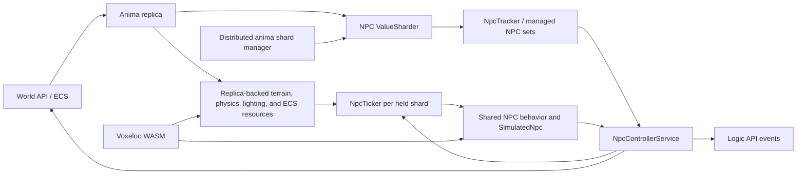

# Anima

Anima is the authoritative NPC simulation service. Its server orchestration is TypeScript in `src/server/anima`, and the reusable NPC model and behavior logic live in `src/shared/npc`.

Anima is primarily custom Biomes code. It is not built around an external behavior-tree or game-AI framework. Behavior selection, combat, movement, schedules, escorts, pathfinding, memory, and serialization are implemented in the repository. [Voxeloo](./voxeloo.md) supplies compact terrain data structures and the native `findSurfaces` operation, but Anima's decision-making remains TypeScript.

## Runtime architecture

`AnimaServer.start()` performs four major operations:

1. It creates an NPC value sharder and `NpcTracker`.
2. It builds replica-backed terrain, water, lighting, physics, and indexed ECS resources, then starts the replica.
3. It connects the NPC sharder to the distributed `anima` shard manager.
4. It starts `NpcControllerService` and then begins shard acquisition.

## Ownership and sharding

Anima distributes NPCs by entity ID modulo the shard manager's current shard count. Replica changes that add, change, or remove `npc_metadata` update the value sharder. Only NPCs mapped to held shards appear in the managed sets used by `NpcTicker`.

The service reports each held shard's recent tick duration back to the shard manager as its weight. This lets ownership balancing account for simulation cost rather than treating all NPC shards as equal.

## Tick and write path

`NpcControllerService` owns one `NpcTicker` context per held shard. On each service tick it:

- waits for the previous apply associated with those shards;
- ticks all currently held shard contexts;
- merges their `TickUpdates` state deltas and game events;
- batches ECS writes and publishes events as `GameEvent`s from `AnimaId`;
- removes contexts for shards the process no longer owns.

`NpcTicker` keeps `SimulatedNpc` instances synchronized with the replica. It advances behavior using a fixed time step, while reducing CPU cost for distant NPCs through distance-based tick ratios and entity-ID staggering. Dead NPCs avoid normal behavior work. Spawn-event NPCs with day/night restrictions are removed when the world enters the opposite phase.

State writes normally go through `WorldApi.apply()`. When the process is explicitly configured for HFC writes and the world API is hybrid, updates are partitioned between RC and HFC. Logic events are published separately through `LogicApi`.

## Behavior and state model

`SimulatedNpc` is the mutable tick facade over an ECS NPC. It tracks external state, custom serialized behavior state, movement, health, combat targets, and generated events. Calling `finish()` produces the ECS deltas and events for the controller.

Behavior code under `src/shared/npc/behavior` includes:

- chase/attack targeting and combat geometry;
- pathfinding and locomotion selection;
- meander, patrol, return-home, flee, swim, fly, and drowning behavior;
- socialization, schedules, anchor following, and rotation;
- escort formation, leash, recovery, warp, and combat policy.

NPC definitions and authored behavior parameters come from Bikkie. Durable runtime state remains in ECS components, including `npc_metadata`, `npc_state`, position, orientation, velocity, health, and public combat state.

## Failure and lifecycle semantics

Anima releases shard ownership before stopping its tick controller and replica, preventing a shutting-down process from continuing to claim authority. Per-shard pending apply promises are retained until writes finish, including when a shard is released.

The controller currently uses `Promise.allSettled()` for a tick's state batches and event publication. Individual write or publish failures therefore do not reject the entire tick. That is current behavior and is captured by tests; changing it is an operational policy change, not just a refactor.

## Test and upgrade baseline

Service-level tests live in `src/server/anima/test`. Shared behavior tests live under `src/shared/npc/**/test` and now also exercise the integration contracts used by Anima: sharding, controller batching, lifecycle, tick scheduling, anchors, memory/dialogue, patrol and schedules, return-home, drowning, steering, combat geometry, pathfinding, escorts, and native surface finding.

Before upgrading Anima, preserve these compatibility points:

1. `npc_state` serialization must read state produced by the previous deployment.
2. Bikkie behavior data and TypeScript behavior schemas must be deployed compatibly.
3. Shard assignment and pending-write cleanup must remain stable during rolling handoff.
4. RC/HFC partitioning must be tested in both enabled and disabled modes.
5. Voxeloo's `findSurfaces` export and terrain tensor ABI must be upgraded with its generated TypeScript declarations and WASM artifact.
6. Run service tests and the shared NPC behavior suite together; service tests alone do not execute every behavior branch.

Related source: `src/server/anima`, `src/shared/npc`, `voxeloo/anima`, and `voxeloo/js_ext/anima.cpp`.
