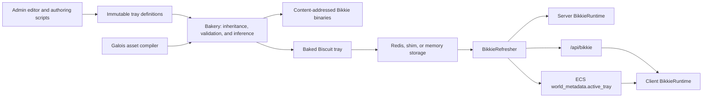

# Bikkie

Bikkie is Biomes' versioned system for authored, mostly static game definitions. A Bikkie record is called a **Biscuit**. Biscuits define shared facts such as item names, stack sizes, rendering assets, block hardness, recipes, NPC behavior, drops, buffs, quests, and farming rules.

Bikkie is not the authoritative store for changing world state. [The native ECS](./ecs.md) stores entities, inventories, health, terrain shards, NPC state, planted crops, and other runtime data. ECS records normally keep a Biscuit ID and resolve the shared definition through Bikkie.

## System map



## Core concepts

| Concept       | Meaning                                                                                                  |
| ------------- | -------------------------------------------------------------------------------------------------------- |
| Biscuit       | One definition with a stable `BiomesId`, an internal name, and typed attributes.                         |
| Attribute     | A typed field with a stable numeric ID, a code-facing name, and optional editor metadata or fallback.    |
| Schema path   | A structural category such as `/items/seed` or `/npcs/types`, determined by required attributes.         |
| Tray          | An immutable, versioned set of Biscuit definition changes layered over an optional parent tray.          |
| Bakery        | The compiler that resolves tray and Biscuit inheritance, runs inference rules, and emits baked Biscuits. |
| BikkieRuntime | The process-local registry used by game code to look up baked Biscuits and schema members.               |

## What Bikkie owns

Bikkie owns authored definitions and shared defaults. The main consumers are:

- ECS entities and items, which store Biscuit IDs plus dynamic instance state;
- [Anima](./anima.md), which reads NPC types, spawn events, effects, global tuning, and behavior parameters;
- combat code, which reads item, block, buff, drop, and NPC combat attributes;
- [Gaia](./gaia.md), especially farming, which reads seed, crop, growth, fertilizer, crossbreeding, and drop definitions;
- [Galois](./galois.md), which supplies logical asset paths and compiles uploaded Bikkie VOX data into inferred meshes and icons.

The detailed boundary for each system is in [System integrations](../bikkie/system-integrations.md).

## Looking up Biscuits

Use `anItem()` when the value is an item or an ECS item stack. It layers per-instance payload attributes over the shared Biscuit definition:

```ts
const tool = anItem(BikkieIds.pickaxe);
const dps = tool.dps;
```

Use the runtime directly for definition lookups and schema queries:

```ts
const biscuit = getBiscuit(id);
const seeds = getBiscuits(bikkie.schema.items.seed);

if (bikkie.schema.npcs.types.check(biscuit)) {
  // biscuit is structurally an NPC type
}
```

`getBiscuit(id)` is deliberately forgiving: an unknown ID produces a placeholder with fallback attributes. Use `getBiscuitOnlyIfExists()` when absence must be distinguished from a placeholder.

## Biscuit editor

The main editor is available at `/admin/bikkie` in a local admin-enabled environment.


The editor can search by internal name, display name, ID, or schema path. It exposes required and recommended attributes for the selected schema, domain-specific editors for complex values, Biscuit inheritance, and inferred binary attributes.


Saving does not mutate a tray in place. It creates a new active tray, requests a bake, publishes changed binary outputs, stores the baked result, and notifies servers and clients to refresh. The connected environment determines which backing store is changed; do not assume that opening the editor locally implies an isolated content database.

## Source locations

- Attribute registry and baked `Biscuit` interface: `src/shared/bikkie/schema/attributes.ts`
- Structural schema paths: `src/shared/bikkie/schema/biomes.ts`
- Tray definitions and inheritance: `src/shared/bikkie/tray.ts`
- Process-local runtime: `src/shared/bikkie/active.ts`
- Baking and inference: `src/server/shared/bikkie/bakery.ts`, `src/server/bikkie/inference.ts`
- Storage and refresh: `src/server/shared/bikkie/storage`, `src/server/shared/bikkie/bikkie_refresher.ts`
- Admin UI and APIs: `src/client/components/admin/bikkie`, `src/pages/api/admin/bikkie`

## Reading next

- [Architecture and data model](../bikkie/architecture-and-data-model.md)
- [Authoring, baking, and assets](../bikkie/authoring-baking-and-assets.md)
- [Runtime, storage, and refresh](../bikkie/runtime-storage-and-refresh.md)
- [System integrations](../bikkie/system-integrations.md)
- [Testing and upgrades](../bikkie/testing-and-upgrades.md)
