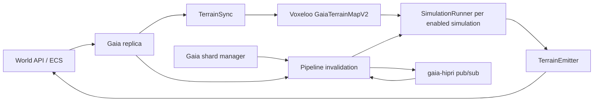

# Gaia

Gaia is the authoritative server for continuous, non-player-driven world simulation. It is a Node.js/TypeScript service in `src/server/gaia`, while its large voxel and tensor calculations are implemented by [Voxeloo](./voxeloo.md), the project's C++ library compiled to WebAssembly.

Gaia owns derived natural state such as:

- farming and plant progression;
- flora decay, regrowth, and muck interaction;
- tree, leaf, and ore growth;
- muck and water propagation;
- irradiance and sky occlusion;
- entity lifetime and terrain restoration.

Gaia does not replace the ECS or Logic server. Terrain and simulation state remain ECS components in the world store. Gaia subscribes to those components, computes the next authoritative state, and submits ordinary ECS updates through `WorldApi`.

## Runtime architecture

The service is assembled in `src/server/gaia/main.ts` through the registry. Startup proceeds in two important stages:

1. `Pipeline.start()` subscribes to replica changes and starts one background runner for each enabled simulation.
2. `Sharder.start()` acquires distributed ownership and seeds its index from all terrain shards already in the replica.

`TerrainSync` is created before the server starts. It builds the initial native terrain map from the replica, buffers changes that arrive during the build, applies the buffered changes, and then switches to direct incremental updates.

## Sharding and work ownership

Gaia shards work by terrain `ShardId`. Every vertical shard with the same X/Z column is assigned to the same distributed ownership shard. This is important for simulations such as water, lighting, and sky occlusion that depend on vertical neighbors.

Each simulation has its own `SimulationRunner` and pending queue. A runner:

- receives invalidations from replica changes;
- accepts high-priority shard handoff through `gaia-hipri` pub/sub;
- processes only shards currently owned by this Gaia instance;
- requeues work when a simulation requests a later update;
- sends generated changes to the shared `TerrainEmitter`.

On shutdown, Gaia first records pending work, releases shard ownership, waits for another instance to acquire it, publishes the unfinished shard lists, and then stops the pipeline. This handoff is part of the service's availability contract and should remain covered during an upgrade.

## Terrain data boundary

The ECS terrain entity is the durable boundary. The main terrain components consumed or produced by Gaia include:

- `shard_seed` and `shard_diff` for base and edited terrain;
- `shard_water`, `shard_muck`, `shard_irradiance`, and `shard_sky_occlusion`;
- `shard_growth`, `shard_dye`, `shard_farming`, and related farming entities;
- source entities such as light sources and unmuck sources.

`TerrainSync` decodes these components into Voxeloo tensors and blocks. Simulations operate on those native structures. `TerrainEmitter` serializes changed tensors back into ECS component buffers and submits them with `WorldApi.apply()`.

Native objects have explicit lifetimes. Code that creates Voxeloo maps, tensors, blocks, or builders must delete them, normally through the project's `using` or `usingAsync` helpers.

## Configuration and observability

The enabled simulation list comes from the Gaia command-line configuration and defaults to every value in `zSimulationName`. Operational configuration under `CONFIG` controls queue timing, shutdown delay, dry-run behavior, missing-shard tolerance, farming cadence, and other simulation-specific limits.

Important metrics include acquired Gaia shards, acquired world shards, pipeline task count, emitted changes, emission errors, and Voxeloo-exported native metrics.

## Test and upgrade baseline

The primary TypeScript tests are under `src/server/gaia/test`, with additional farming and terrain tests beside their implementations. They cover lifecycle ordering, sharding, queues, invalidation, simulation registration, terrain-map bootstrap and incremental updates, native tensor serialization, the pipeline, and emitter failure behavior.

Voxel algorithms also have native tests under `voxeloo/gaia` and WebAssembly integration tests under `src/shared/wasm/test`. See [Voxeloo](./voxeloo.md) for the native/WASM test boundary.

Before upgrading Gaia, preserve these compatibility points:

1. ECS component buffer encodings must remain readable across the deployment.
2. Voxeloo TypeScript declarations, Embind exports, generated loader, and `.wasm` binary must be upgraded together.
3. Old and new Gaia instances must agree on sharding and pub/sub handoff formats during a rolling deployment.
4. Run both the TypeScript service tests and Voxeloo's native tests; either suite alone misses part of the system.
5. Compare generated ECS deltas on representative terrain snapshots before enabling writes in production.

Related source: `src/server/gaia`, `voxeloo/gaia`, and `voxeloo/js_ext`.
