# Galois

Galois is Biomes' asset definition, compilation, and publication system. It turns authored source files and declarative TypeScript recipes into the meshes, textures, indexes, tensors, icons, audio, generated definitions, and other data consumed by the game.

Galois is not an authoritative gameplay service. [Gaia](./gaia.md) owns continuous world simulation, [Anima](./anima.md) owns NPC simulation, and the [native ECS](./native-ecs.md) stores durable game state. Galois instead owns the reproducible transformation from source content to runtime asset data.

The name also appears in `voxeloo/galois`, the native C++ asset- and material-processing library. The Galois build system uses that library through Python bindings, while server and client runtime code can use related Voxeloo functions through WebAssembly. The native library is a component of Galois, not a separate asset service.

## System map

```mermaid
flowchart LR
  Source["Source assets under src/galois/data"] --> Recipes["TypeScript asset recipes"]
  Defs["Python DSL definitions"] --> Generated["Generated TypeScript DSL"]
  Generated --> Recipes
  Recipes --> Program["Serialized dependency program"]
  Program --> Node["Node asset server and worker pool"]
  Node --> Python["Python materializers"]
  Python --> Pybind["Voxeloo pybind bindings"]
  Pybind --> Output["GLB, GLTF, PNG, JSON, indexes, tensors, and buffers"]
  Output --> Static["Content-addressed static publication"]
  Static --> Index["asset_versions.json"]
  Index --> Consumers["Client and server asset URL resolution"]
  Output --> Runtime["On-demand animated player mesh export"]
```

## Main layers

| Layer             | Main locations                                                                       | Responsibility                                                                                                 |
| ----------------- | ------------------------------------------------------------------------------------ | -------------------------------------------------------------------------------------------------------------- |
| Source content    | `src/galois/data`                                                                    | Raw VOX, PNG, GLTF, Blender, audio, mapping, and tensor inputs                                                 |
| Asset recipes     | `src/galois/js/assets`                                                               | Named asset graphs for blocks, flora, glass, terrain, items, NPCs, placeables, wearables, and audio            |
| Asset language    | `src/galois/py/assets/defs`, `src/galois/js/lang`, `src/gen/galois/js/lang`          | Type and routine definitions, generated TypeScript constructors, hashing, graph traversal, and transport       |
| Build runtime     | `src/galois/js/server`, `src/galois/py/assets/build.py`, `src/galois/py/assets/impl` | Worker management, dependency materialization, caching, serialization, and error transport                     |
| Native processing | `voxeloo/galois`, `voxeloo/py_ext`                                                   | CSG, shapes, terrain IDs, sampling, geometry, groups, lighting, materials, water, and compact buffers          |
| Publication       | `src/galois/js/publish`, `src/galois/js/interface/gen`                               | Content hashing, static upload, generated definitions, host configuration, and logical-to-versioned path index |
| Runtime exports   | `src/galois/js/interface/asset_server`, `src/pages/api/assets/player_mesh.glb.ts`    | On-demand animated player GLB generation from Bikkie wearables and character colors                            |

## Authority and compatibility boundaries

Galois source files and recipes are build inputs. Published files are immutable, content-addressed outputs. `asset_versions.json` is the deployable pointer from a stable logical name such as `icons/items/axe` to one exact generated object.

Bikkie records and game code refer to logical Galois paths. They should not depend directly on a generated hash. A publication must upload the new hashed object before an updated index or Bikkie reference can make it reachable.

The runtime player-mesh endpoint is narrower than the offline compiler. It currently accepts only `wearables/animated_player_mesh`, combines wearable descriptors and palette selections, and returns a GLB. Changes that alter generated player meshes must also consider the shared asset-export version and server/CDN caches.

## Reading next

- [Architecture and data flow](../galois/architecture.md)
- [Asset language and build runtime](../galois/asset-language-and-build-runtime.md)
- [Publishing and runtime serving](../galois/publishing-and-serving.md)
- [Testing](../galois/testing.md)
- [Migrations and upgrades](../galois/migrations-and-upgrades.md)
