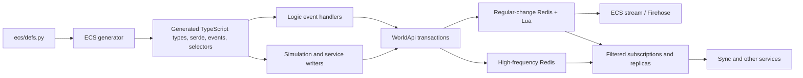

# Native ECS architecture

The native ECS is Biomes' custom dynamic-state platform. "Native" here means native to the Biomes codebase; the core ECS is not the C++/WebAssembly code in [Voxeloo](./voxeloo.md).

It combines a generated data model with an optimistic transaction layer, Redis-backed storage, filtered subscriptions, and in-process replicas. Gameplay services use the same contracts whether they are handling player events, simulating NPCs, or updating terrain metadata.

## System map

## Layers and ownership

| Layer                | Main locations                   | Responsibility                                                                                                       |
| -------------------- | -------------------------------- | -------------------------------------------------------------------------------------------------------------------- |
| Schema and generator | `ecs/`, especially `ecs/defs.py` | Stable component IDs, field definitions, events, selectors, visibility, and generated source                         |
| Shared ECS runtime   | `src/shared/ecs`                 | Changes, tables, indexes, versions, generated entities, JSON/ZRPC serialization, and client/server-neutral contracts |
| Server ECS runtime   | `src/server/shared/ecs`          | Lazy Redis-backed entities, transaction checks, subscription filters, and signed untrusted applies                   |
| World layer          | `src/server/shared/world`        | Reads, optimistic writes, Redis/Lua storage, subscriptions, HFC routing, and in-memory test implementation           |
| Replica layer        | `src/server/shared/replica`      | Materialized or lazy local views built from world subscriptions                                                      |
| Logic authority      | `src/server/logic/events`        | Validates gameplay intent and turns generated ECS events into authorized transactions                                |

## Core data flow

An ECS entity has a `BiomesId` and zero or more generated components. Components are reusable records such as `position`, `inventory`, `label`, or terrain shard data. An update is a component-level delta: omitted properties are unchanged, `null` removes a component, and a value adds or replaces it.

Writers submit `ProposedChange` values because they do not assign ticks. The authoritative world assigns a post-apply tick and emits versioned `Change` values. A change's tick is the version produced by that change, not a precondition.

The main write path is:

1. Read entities and record the entity/component versions that informed the decision.
2. Build one or more transactions containing optimistic `iffs`, proposed changes, optional Firehose events, and optional catch-up requests.
3. Apply each transaction atomically against the authoritative regular-change world.
4. Publish successful changes to the ECS stream.
5. Bootstrap and continuously update service replicas and clients through subscriptions.

## Authority boundaries

The ECS stores state and enforces transaction preconditions, but it does not decide whether a gameplay action is allowed. Logic event handlers and privileged services own that authorization.

- Player-originated intent normally enters through generated ECS events handled by the logic server.
- Direct world writes are appropriate for trusted services that own a simulation domain.
- Signed untrusted apply requests provide integrity, user binding, and a short validity window; they do not replace gameplay authorization.
- [Gaia](./gaia.md) owns natural terrain simulation, while [Anima](./anima.md) owns NPC simulation. Both integrate through ECS contracts, and both use [Voxeloo](./voxeloo.md) for specialized spatial or voxel computation rather than for ECS storage.

## Reading next

- [Components and events](../ecs/components-and-events.md)
- [Transactions and authority](../ecs/transactions-and-authority.md)
- [Replication and storage](../ecs/replication-and-storage.md)
- [Migrations and upgrades](../ecs/migrations-and-upgrades.md)
- [Testing](../ecs/testing.md)
