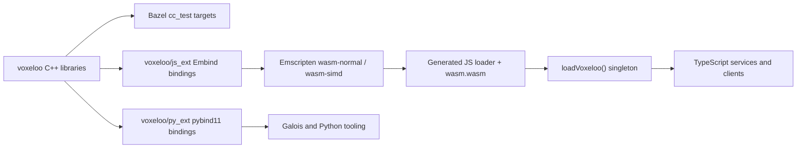

# Voxeloo

Voxeloo is Biomes' native voxel, tensor, geometry, simulation, and asset-processing library. It is written in C++ and built with Bazel. Server and browser TypeScript call it through an Emscripten/WebAssembly build exposed with Embind; Python asset tooling uses separate pybind11 bindings.

Voxeloo is a library, not a standalone game service. [Gaia](./gaia.md), [Anima](./anima.md), Galois, client rendering, mapping, and maintenance scripts all consume parts of it.

For module-level ownership and invariants, see [Native modules](../voxeloo/native-modules.md). For language-boundary contracts, memory ownership, and the upgrade test matrix, see [Bindings and testing](../voxeloo/bindings-and-testing.md).

## Source and build layers



The main C++ packages include:

- `voxeloo/common`: geometry, spatial structures, blocks, runs, utilities, and low-level primitives;
- `voxeloo/tensors`: dense and succinct tensor structures and routines;
- `voxeloo/biomes`: game-oriented voxel structures, culling, rasterization, shards, and migration helpers;
- `voxeloo/gaia`: terrain maps and lighting, muck, water, and terrain simulation kernels;
- `voxeloo/anima`: native surface extraction used by NPC logic;
- `voxeloo/galois`: asset and material processing;
- `voxeloo/js_ext` and `voxeloo/py_ext`: language bindings.

`voxeloo/js_ext/BUILD.bazel` defines normal and SIMD WebAssembly builds. The server uses the generated SIMD loader and `.wasm` artifact under `src/gen/shared/cpp_ext/voxeloo-simd`. `loadVoxeloo()` loads that artifact once per process, provides imported WebAssembly memory, installs native error reporting, and returns the shared module instance.

## TypeScript boundary

Handwritten TypeScript declarations under `src/shared/wasm/types` describe the Embind surface. Helpers under `src/shared/wasm` wrap native buffers, blocks, and tensors in safer TypeScript APIs.

This boundary has four pieces that must agree:

1. the C++ implementation;
2. the Embind registration in `voxeloo/js_ext`;
3. the generated JavaScript loader and `.wasm` binary;
4. the TypeScript declarations and wrappers.

Changing only one piece can compile on one side while failing at runtime on the other. Treat these artifacts as one versioned unit during upgrades.

## Memory ownership

Most Embind-created objects represent C++ heap allocations and expose `delete()`. Garbage collection of the JavaScript wrapper is not a substitute for releasing the native allocation.

Use `using`, `usingAsync`, or `usingAll` whenever the lifetime fits those helpers. Objects stored for a service's lifetime, such as Gaia's terrain map, need an explicit cleanup registration. Iterators and temporary chunks returned by native maps may also require deletion; check the wrapper contract rather than assuming a borrowed value.

The WebAssembly build uses imported memory, allows growth up to 4 GB, and aborts on allocation failure. The server loader currently creates a large fixed memory allocation by default, configurable through `WASM_MEMORY`. Memory regressions should therefore be checked in resident native memory as well as the JavaScript heap.

## Gaia and Anima integration

Gaia is Voxeloo's heaviest server consumer. It builds `GaiaTerrainMapV2` from ECS shard buffers and invokes native kernels for irradiance, sky occlusion, water, muck, terrain, and related tensor operations. The resulting tensors are serialized back into ECS components.

Anima consumes Voxeloo through terrain, water, lighting, and physics resources used by NPC behavior and pathfinding. Its direct Anima-specific native API is `findSurfaces`, which scans terrain tensors and returns valid surface points. NPC decisions themselves remain TypeScript.

## Tests

Voxeloo has three complementary test layers:

- native Catch2/Bazel tests, including direct Anima surface, mapping-height, migration, Gaia, common, and tensor tests;
- Python tests that load the built pybind extension and exercise binary, NumPy, geometry, shard, and tensor contracts;
- TypeScript WebAssembly tests under `src/shared/wasm/test`, including normal/SIMD export and behavior parity;
- consumer integration tests in Gaia and Anima, including terrain-map simulation and `findSurfaces` behavior.

Run the native suite from the repository root with:

```shell
bazel test //voxeloo/...
```

Run the ECS generator tests, which protect the schema that feeds Voxeloo-consuming services, with:

```shell
bazel test //ecs:ecs_ast_test //ecs:ts_test
```

Run the TypeScript/WASM boundary with:

```shell
./b test -p 'src/shared/wasm/test/*.test.ts'
./b test -p 'src/server/gaia/test/*.test.ts'
./b test -p 'src/server/anima/test/*.test.ts'
```

The detailed assertions and expected wire layouts are listed in [Bindings and testing](../voxeloo/bindings-and-testing.md).

## Upgrade checklist

When upgrading Emscripten, Bazel rules, compiler settings, or Voxeloo internals:

1. Rebuild both normal and SIMD targets and regenerate the checked-in/generated loader artifacts expected by the application.
2. Run all native tests, then the WebAssembly tests, then Gaia and Anima integration tests.
3. Verify serialized block and tensor compatibility against representative existing ECS buffers.
4. Exercise exception translation and native error logging, not only successful calls.
5. Check explicit deletion and native memory usage under repeated simulation ticks.
6. Compare SIMD and non-SIMD results where both targets are supported.
7. Deploy the loader, declarations, wrappers, and `.wasm` binary atomically.

Related source: `voxeloo`, `src/shared/wasm`, and `src/server/shared/voxeloo.ts`.
