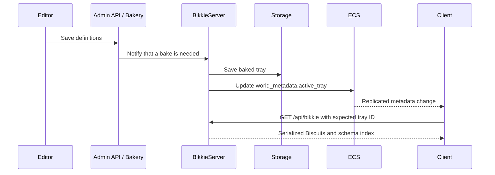

# Bikkie runtime, storage, and refresh

Bikkie uses different stores for authoring metadata, tray definitions, baked runtime content, and binary files. The process-local `BikkieRuntime` is a cache and lookup layer over baked content, not the durable authority.

## Durable data layout

| Data                | Role                                          | Current boundary                            |
| ------------------- | --------------------------------------------- | ------------------------------------------- |
| Active tray pointer | Selects the authored version to bake          | `bikkie/active` in the application database |
| Biscuit names       | Maps stable IDs to unique internal names      | `bikkie/names` in the application database  |
| Tray metadata       | Name, author, time, parent, compaction source | Application database documents              |
| Tray definitions    | Attribute assignments and parent linkage      | `BikkieStorage.saveDefinition()`            |
| Baked tray          | Runtime Biscuits and per-definition hashes    | `BikkieStorage.save()`                      |
| Binary bytes        | Uploaded and inferred VOX, GLB, and PNG data  | Bikkie staging and static object storage    |

The authoring database and baked storage are deliberately separate. Updating the active definition pointer does not itself make new runtime Biscuits available; the Bikkie server must successfully bake and save them.

## Storage implementations

`registerBikkieStorage()` selects one of three modes:

- `redis2`: stores definitions and baked Biscuits in Redis;
- `shim`: calls a remote shim-owned `BikkieStorage` over ZRPC;
- `memory`: keeps definitions and baked content in process for tests or isolated use.

Redis stores baked Biscuits by tray and Biscuit ID, plus the current baked tray ID. On load it can reuse objects from a prior tray when the stored definition hash is unchanged. Old baked-tray keys receive an expiry after a new tray is committed.

There is also a legacy definition reader for trays encoded directly in application-database documents. It remaps historical attribute IDs below 200 into the current Bikkie range while decoding.

## Server refresh path

`BikkieRefresher` listens to the tray notifier. A refresh:

1. loads the current baked tray from `BikkieStorage`;
2. applies any configured code-authored overlay;
3. registers the effective Biscuits in the process-global `BikkieRuntime`;
4. records the effective tray as the process' current view.

The current repository applies `withHarthmereNativeBikkieItems()` during this step. That overlay preserves or allocates stable Bikkie IDs while projecting code-authored Harthmere items, recipes, and NPC types into the effective tray.

An overlay is part of the content-version contract even though it is not stored in the underlying tray definition. If overlay output changes, its version, effective hashes, client URL, and cache behavior must change together.

## BikkieRuntime behavior

`BikkieRuntime` provides:

- lookup by ID through `getBiscuit()`;
- strict lookup through `getBiscuitOnlyIfExists()`;
- schema queries through `getBiscuits()`;
- an epoch that increments on every registration;
- `bikkieDerived()` values that recompute after the epoch changes;
- a `refreshed` event for process-local consumers.

Already-materialized Biscuits are updated in place. Code holding a Biscuit or `Item` reference therefore observes new properties after refresh without replacing every reference. New client Biscuits are lazily deserialized when first accessed.

Schema queries should pass a schema path or schema walker. Calling `getBiscuits()` without a schema materializes the entire tray and is intentionally warned about on the client.

## Client boot and refresh

`/api/bikkie` returns:

- the baked tray ID;
- each Biscuit ID and serialized payload;
- the complete schema-path list;
- compact schema-membership indexes for each Biscuit.

The response encoder is cached by immutable tray ID. The client preserves unchanged serialized Biscuits, creates `LazyBiscuit` objects for changed entries, builds a schema-to-ID index, and registers them in its runtime without blocking the main thread for one long decode.

At initial boot, the client loads the current tray with no expectation. During play, Sync delivers the world metadata entity. When `active_tray.id` changes, the client requests `/api/bikkie?expectedTrayId=...` and batches duplicate refresh requests.

If the request's expected ID matches the returned tray, the HTTP response is marked immutable. Code-authored overlays therefore require a separate version in the request URL; the current client includes `HARTHMERE_NATIVE_BIKKIE_OVERLAY_VERSION` for that purpose.

## Why ECS contains `active_tray`

The `ActiveTray` ECS component on `WorldMetadataId` is a control-plane signal, not Bikkie's content store. It lets the existing replicated world stream tell every connected client that a new static-content version exists.

The sequence is:

Publishing the ECS signal before the baked tray is readable can create refresh loops or stale responses, so storage commit must happen first.

## Caches and epochs

Bikkie uses several independent caches:

- tray-definition caches in the Bakery;
- inference caching, keyed by inference epoch, rule, and inputs;
- optional Redis Bikkie cache;
- per-definition hashes for incremental baking and loading;
- process-local baked tray and runtime-derived caches;
- encoded `/api/bikkie` response caches;
- browser and CDN caches for immutable responses and published binaries.

Deleting a cache should make the path slower, not change the resulting Biscuit. When semantics change without an input-shape change, bump the relevant epoch or version rather than relying on process restarts.

Current implementation caveat: `BikkieRedisCache` computes a `bikkieCacheEpoch`-prefixed key for its in-flight map, but its persisted Redis reads and writes currently use the unprefixed key. Do not rely on `bikkieCacheEpoch` alone to invalidate persisted entries until that storage-key path is corrected and tested.

## Failure boundaries

- Saving definitions can succeed before baking succeeds; the active authored tray and current baked tray are separate checkpoints.
- Inference failure may retain a prior value when one exists, so logs and hashes must be checked when validating a change.
- Missing Bikkie binaries fail independently from a successfully loaded tray.
- An unknown ID can resolve to a placeholder, masking missing content unless a strict lookup or schema assertion is used.
- A service with refresh disabled or a failed notifier can continue serving its prior in-process tray.
