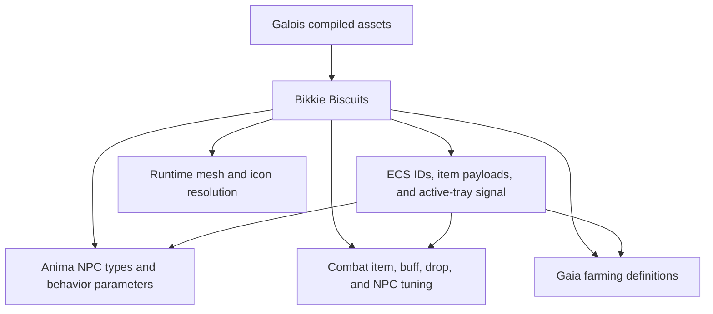

# Bikkie system integrations

Bikkie is the shared definition layer across several otherwise independent systems. The consistent boundary is: Bikkie provides authored identity and defaults; ECS and authoritative services own changing state and validate actions.

## ECS

The [native ECS](../basics/native-ecs.md) stores dynamic entities. It refers to Bikkie rather than duplicating definitions.

Common examples include:

- inventory, equipment, grab bags, drops, and recipes storing item IDs and optional item payloads;
- `npc_metadata.type_id` selecting an NPC-type Biscuit;
- `placeable_component.item_id` selecting a placeable item definition;
- `farming_plant_component.seed` selecting a seed and farming definition;
- quest and trigger state referring to challenge, trigger, and item Biscuit IDs.

Per-instance item payloads are keyed by Bikkie attribute ID and override the shared Biscuit when `anItem()` is constructed. Position, quantity, durability state, ownership, health, cooldowns, and simulation progress remain ECS or event state.

The one Bikkie control value replicated through ECS is `world_metadata.active_tray`. It tells clients to fetch a new tray; it does not contain the tray.

### Boundary rule

If a value can differ between two entities with the same type at the same instant, it normally belongs in ECS or an item payload. If it is an authored default shared by every entity with that ID, it is a Bikkie candidate.

## Anima

[Anima](../basics/anima.md) resolves each NPC's `npc_metadata.type_id` through `/npcs/types`. The required NPC-type attributes are:

- `displayName`;
- `boxSize`;
- `rotateSpeed`;
- `walkSpeed`;
- `runSpeed`;
- `behavior`.

Recommended attributes include presentation, drops, population limits, effects, lifetime, and player-like appearance.

The `behavior` object configures capabilities and parameters such as damageability, chase/attack, swimming, flying, meandering, socialization, schedules, and other NPC policies. Anima reads this definition while ticking, but the chosen target, path progress, attack timing, serialized custom state, current health, position, and public combat state remain ECS-backed runtime state.

Anima also consumes:

- `/npcs/spawnEvents` for NPC bags, constraints, density, and enablement;
- `/npcs/effectsProfiles` for sound profiles;
- `/npcs/globals` for shared values such as gravity, knockback, ward range, and the default player attack interval.

Changing an NPC Biscuit can change the behavior of every live NPC with that type after refresh. Changes to the behavior schema must remain compatible with serialized `npc_state` across rolling deployments.

## Combat

Combat is split across client interaction, Logic handlers, Anima, and ECS state rather than being one service. Bikkie contributes authored inputs to all of them.

### Standard Bikkie combat inputs

- item `dps`, action, durability, tool class, and destruction attributes;
- block `hardnessClass`, `preferredDestroyerClass`, drops, contact damage, and surface properties;
- consumable `givesHealth` and `buffs`;
- buff definitions, player modifiers, and `negatesBuffs`;
- NPC `behavior.damageable`, `behavior.chaseAttack`, speeds, size, and drops;
- item and NPC meshes, icons, animations, and effect profiles used for feedback.

`src/shared/game/damage.ts` uses Bikkie item and block attributes for terrain and entity damage. Logic handlers re-resolve the authoritative held item and NPC type before applying damage, drops, durability, buffs, or rewards. ECS owns current health, equipment, attack receipts, status effects, and death state.

### Current Harthmere source-of-truth caveat

Not every Harthmere combat number is authored directly as a Bikkie attribute. `src/shared/harthmere/harthmere_native_combat.ts`, the boss catalogs, projectile catalogs, and item definitions contain specialized profiles keyed by stable Bikkie IDs. The effective Harthmere Bikkie overlay projects common contracts such as item `dps`, NPC `behavior`, and drops into Biscuits, while specialized values such as reach, exact cadence, stamina or mana cost, armor, projectile behavior, and boss phase tuning can still come from those code-authored catalogs.

When changing combat, identify the actual authority before editing a Biscuit. Duplicating one value in Bikkie and a native catalog without a projection or assertion creates client/server drift.

## Gaia

[Gaia](../basics/gaia.md) generally operates on ECS terrain components and Voxeloo tensors. Its main direct Bikkie integration is farming.

For each farming entity, Gaia reads `farming_plant_component.seed`, resolves that Biscuit, and uses its `farming` attribute to construct a ticker. Farm specs can be:

- `basic`: one crop block with growth duration, water, sun, death, irradiance, and drop rules;
- `tree`: authored sapling, log, and group stages using Bikkie leaf and log block IDs;
- `variant`: weighted alternatives containing other farm specs.

Gaia maps referenced block Biscuits through their `terrainName` into generated terrain IDs. It also:

- reads `/items/seed` to build the crossbreeding map;
- reads `fertilizerEffect` from fertilizer items attached to player actions;
- uses Bikkie display names for diagnostics;
- resolves Bikkie drop tables for mature, partial-growth, seed, and crossbreed rewards.

The plant's current stage, moisture, actions, timestamps, expected block tensor, ownership, and terrain writes remain ECS state. Gaia's ticker cache uses `bikkieDerived()`, so a Bikkie refresh rebuilds derived farm behavior on next access.

### Boundary rule

A farm recipe belongs in Bikkie; the progress of one planted crop belongs in ECS. Non-farming Gaia simulations should not be made Bikkie-dependent unless they genuinely require authored per-type configuration.

## Galois

[Galois](../basics/galois.md) is the asset compiler and publisher. Bikkie is the gameplay-content registry that references or feeds it.

The integration has four forms:

1. Biscuits store logical Galois paths such as `galoisPath` and `meshGaloisPath`; `galoisIcon` can store a logical icon name or an explicit URL/path.
2. Bikkie inference uses the Galois build runtime to convert uploaded VOX data into icons, item meshes, and placeable meshes.
3. Runtime player-mesh export reads Bikkie wearable slots, palette choices, VOX binaries, hat variants, and legacy Galois paths before invoking the Galois animated-character recipe.
4. Client resource loaders use Bikkie attributes to choose the correct Galois or content-addressed binary asset.

Galois logical paths and Bikkie binary hashes are different namespaces. Do not put a generated Galois content hash into `galoisPath`, and do not treat a Bikkie binary hash as a Galois logical asset name.

## Integration review checklist

For a Bikkie change that affects one of these systems, answer all of the following:

1. Which stable Biscuit and attribute IDs are involved?
2. Is the changing value static definition data, item-payload data, or ECS state?
3. Which service is authoritative when an action is validated?
4. Does a schema-path membership change affect discovery or indexing?
5. Does the change alter inference, binary publication, or a Galois logical path?
6. Will live NPCs, crops, combatants, or cached client resources safely adopt the new value after refresh?
7. Is there another code-authored catalog or overlay that must be updated or asserted against?
