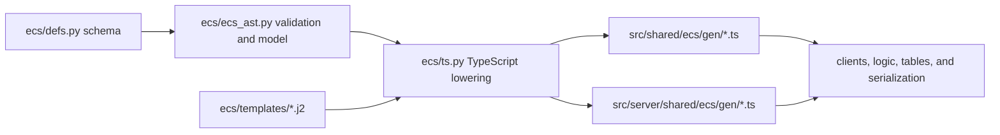

# ECS code generation

The native ECS schema is authored in Python and generated into TypeScript. The generator is part of the persistent-data contract: it assigns names to stable numeric identifiers, lowers schema types into wire-aware TypeScript, and emits the client and server implementations used throughout the system.

## Pipeline



`ecs/defs.py` declares components, events, selectors, field types, visibility, and high-frequency component metadata. `ecs/ecs_ast.py` validates those declarations and builds a normalized model. `ecs/ts.py` lowers that model through Jinja templates into generated TypeScript.

## Generator invariants

- Component, event, and field IDs are wire identifiers. Component IDs are permanent and retired IDs remain reserved.
- Duplicate or reserved symbols and IDs are rejected before files are emitted.
- Component field IDs may be sparse, but their numeric identity and order remain part of the generated schema.
- Structural hashes include ordered type structure so incompatible shape changes produce different generated hashes.
- Synthetic collection and union types are deduplicated by structure.
- Externally defined TypeScript types are registered in an explicit order, keeping output deterministic across Python processes and versions.
- Each `TypeGenerator` gets an isolated helper namespace. Creating a second generator in the same process must not inherit dynamically registered names from the first one.
- Generated files carry a content-hash header. Formatting can change without invalidating the schema, but semantic generator or schema changes must update the hash.

## Output ownership

Do not edit files under `src/shared/ecs/gen` or `src/server/shared/ecs/gen` directly. Shared outputs contain materialized entities, components, events, selectors, serialization, and related types. Server outputs add lazy entities, Redis-oriented serialization, and server-only views.

The TypeScript generator accepts an output root and server-output root so tests and tools can generate into an isolated temporary directory. Templates are resolved relative to the generator source, not the caller's current working directory.

## Tests

Run:

```shell
bazel test //ecs:ecs_ast_test //ecs:ts_test
```

The AST suite covers validation failures, structural hashing, synthetic types, sparse fields, visibility, high-frequency metadata, selectors, production-schema references, and pinned critical component IDs. The TypeScript suite covers primitive and collection lowering, defaults, serialization expressions, generation from an arbitrary working directory, deterministic repeated generation, and checked-in output content hashes.

Pinning a small set of critical component IDs is intentional. It makes an accidental renumbering of foundational persisted components fail immediately, while the broader uniqueness and reference checks protect the complete schema.

## Change workflow

1. Edit `ecs/defs.py`, generator code, or templates.
2. Run the Python generator tests before regeneration.
3. Run `./b gen:ecs` and review every generated diff.
4. Re-run the generator tests and the affected shared/server ECS tests.
5. For wire-visible changes, follow the [migration and upgrade](./migrations-and-upgrades.md) process.

Generator upgrades should first pass the existing tests unchanged. Update assertions only for an intentional, documented contract change.
